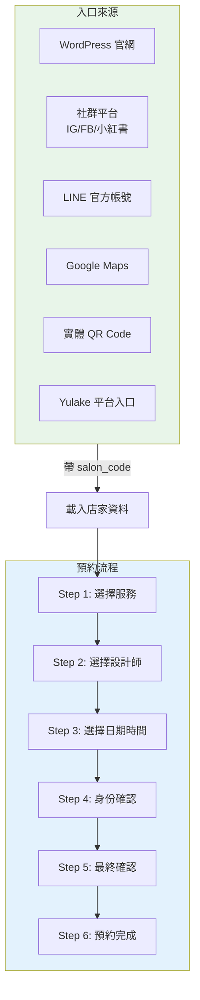
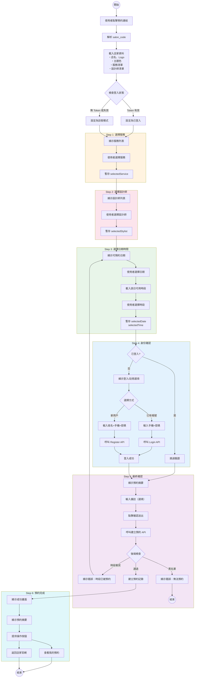
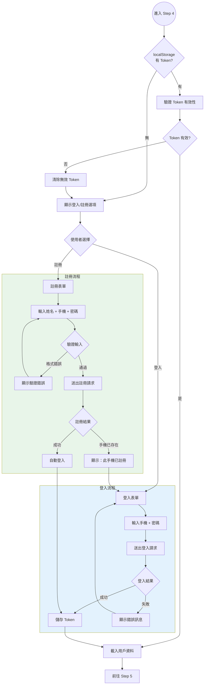
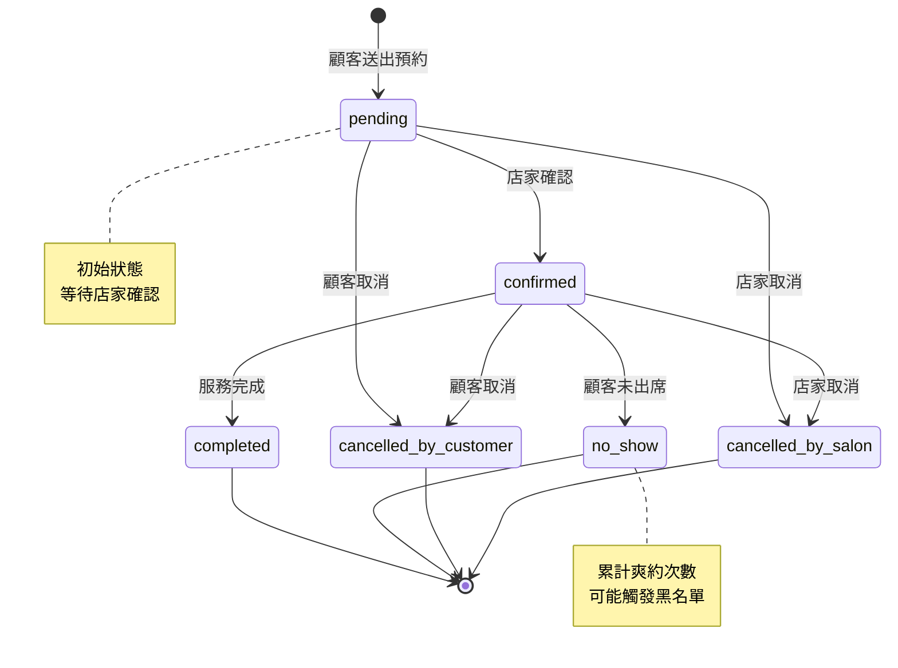
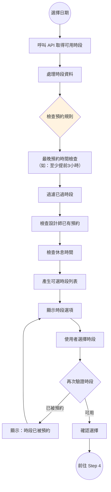
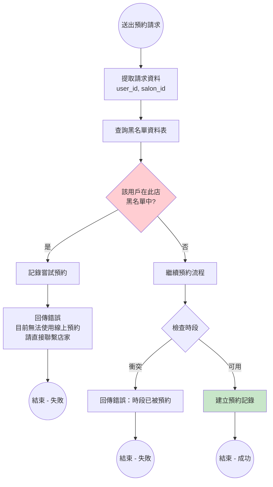

# 約來客 Yulake - 顧客預約流程圖

> 使用 Mermaid 語法，可在 GitHub、GitLab、Notion、VS Code (Markdown Preview Mermaid Support) 等平台直接渲染

## 1. 總覽流程圖 (High-Level Flow)



## 2. 詳細預約流程圖 (Detailed Booking Flow)



## 3. 身份驗證流程圖 (Authentication Flow)



## 4. 預約狀態流轉圖 (Booking Status State Machine)



## 5. 時段選擇邏輯流程圖 (Time Slot Selection Logic)



## 6. 黑名單檢查流程圖 (Blacklist Check Flow)



---

## 如何檢視流程圖

### 方法 1: VS Code 擴充套件
安裝 [Markdown Preview Mermaid Support](https://marketplace.visualstudio.com/items?itemName=bierner.markdown-mermaid)

### 方法 2: GitHub / GitLab
直接 push 此檔案，平台會自動渲染 Mermaid 圖表

### 方法 3: Mermaid Live Editor
複製 Mermaid 程式碼到 [mermaid.live](https://mermaid.live/) 線上編輯器

### 方法 4: 匯出圖片
使用 [mermaid-cli](https://github.com/mermaid-js/mermaid-cli) 匯出 PNG/SVG：
```bash
npm install -g @mermaid-js/mermaid-cli
mmdc -i booking-flow.md -o booking-flow.png
```
