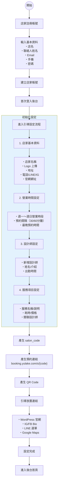
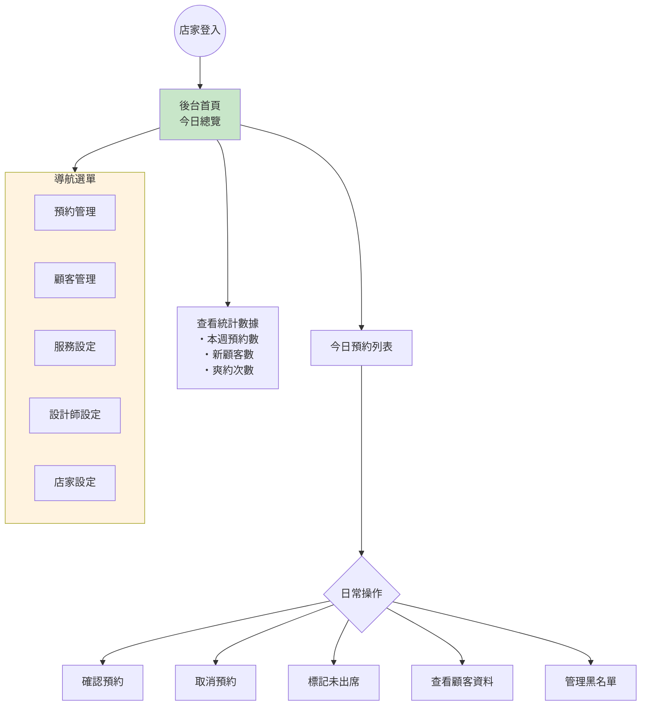
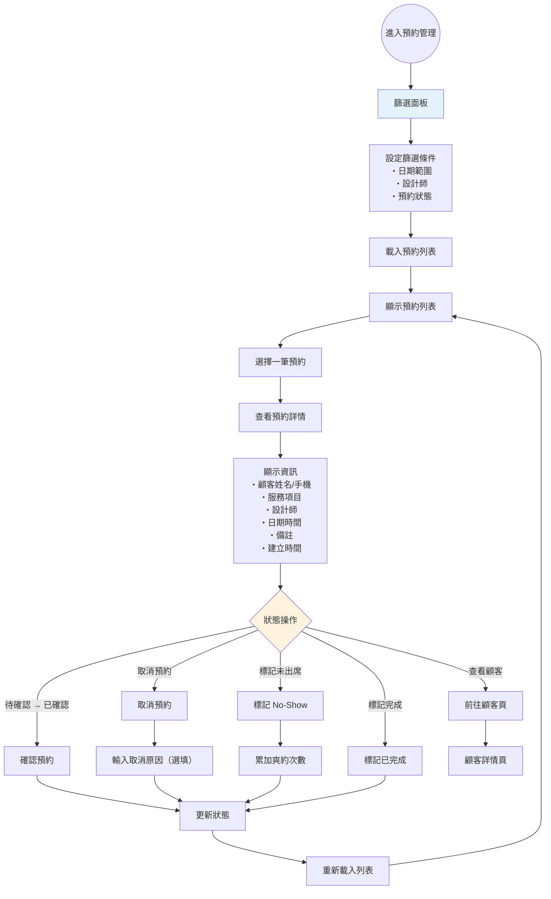
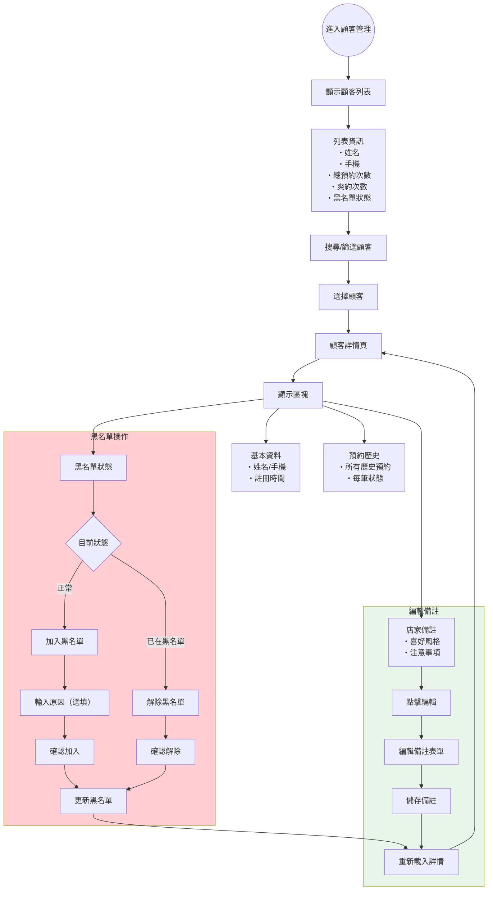
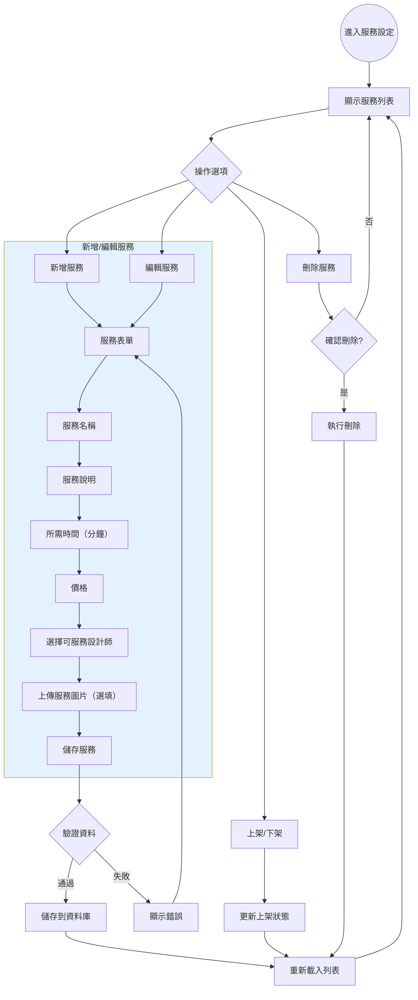
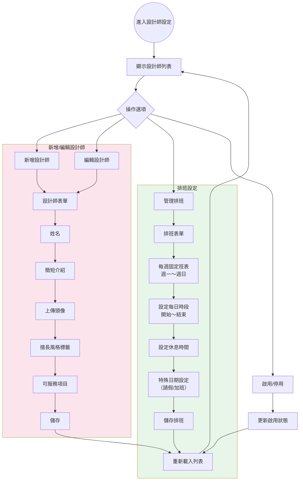
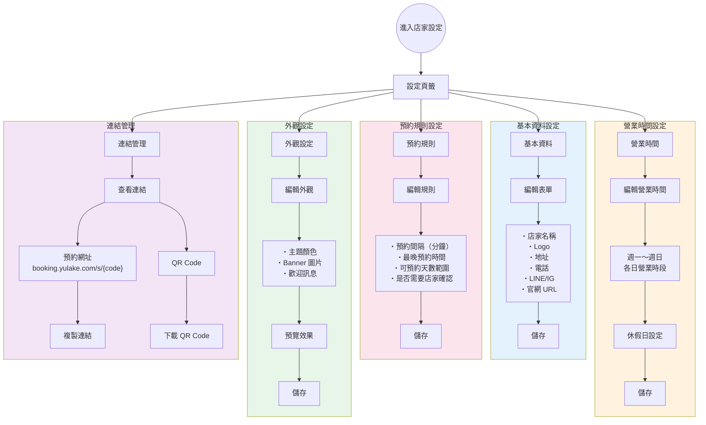
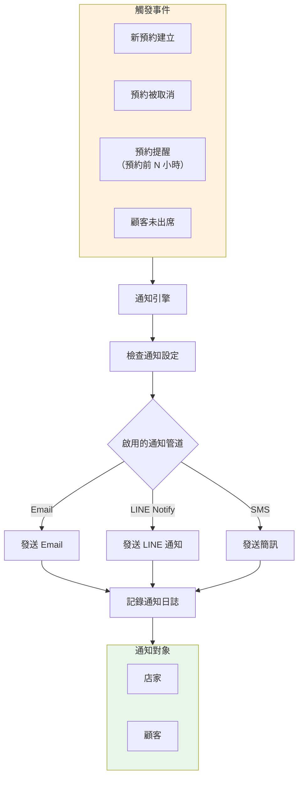

# 約來客 Yulake - 店家後台流程圖

> 店家／廠商在 Yulake 後台的操作流程

## 1. 店家 Onboarding 流程圖

## 2. 店家日常操作總覽

## 3. 預約管理流程圖

## 4. 顧客與黑名單管理流程圖

## 5. 服務項目管理流程圖

## 6. 設計師管理流程圖

## 7. 店家設定流程圖

## 8. 預約通知流程圖（未來擴充）

---

## 流程圖渲染說明

請參考 [booking-flow.md](./booking-flow.md) 中的「如何檢視流程圖」章節。
